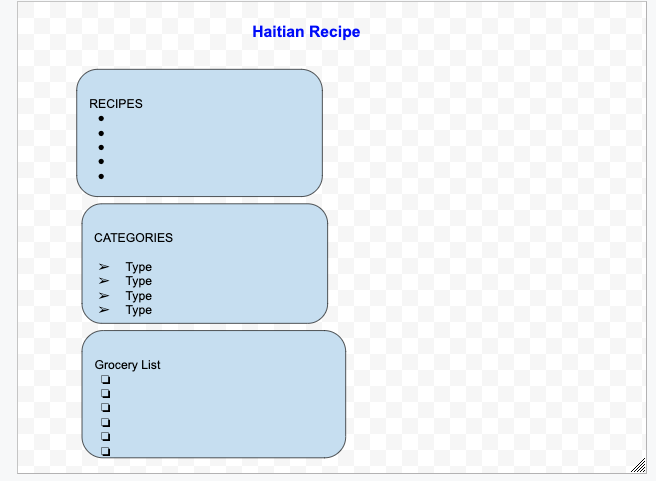

# haitian-recipe-app

## The app is designed to be used by chefs who want to save and publish their creations or existing recipes with their own signature. 

## The database contains three models 
1- Recipes
2- List of items
3- Categories

## Tech used:
- Express js
- node js
- mongodb
- mongoose
- css 
- html
- javascript
- heroku

## Wireframe

## ERD

